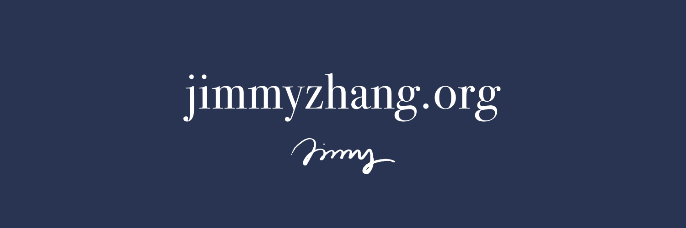

<div align="center">

# Me, Opensourced

<br>
My life's work of thinking, writing, building, and more — compressed into a repo.  
<br>

**"Me as a file system"**

<br>

[Visit my website](https://jimmyzhang.org) &nbsp;·&nbsp; [Interact with your AI Agent](#human-experience) &nbsp;·&nbsp; [Project Vision](#project-vision)

<br>



</div>
<br>

## Project Vision

It starts with these fundamental questions:

> Who am I at the end of the day?  
> What do I actually have to offer the world?  

If I leave this world by accident any time, I hope this repo is all that I leave for this world.

This is the official entry point for the world to learn about me.

<br>


## Repo Layout

This repository has two main parts: `content/` and `site/`.

### Content/ — MD as source of truth

**`content/`** is the actual file system and the only source of truth. It's a collection of plain Markdown files organized into thematic sections. It does not depend on any framework or build tool. The Markdown files *are* the product. Any frontend is just a lens through which to read them.

`content` is divided into several sections or folders. 

| Section | Contents |
|---|---|
| `self` | Who I am — basics, life experiences, self-portrait, skills |
| `telos` | Why I am here — goals, purpose, values |
| `note` | What I learn and think — books, media, ideas |
| `project` | What I have made — products, software, art |
| `writing` | What I have written — essays, opinions |
| `photo` | What I have lived and seen — photography, places |
<br>
<br>


### Site/ — my frontend

**`site/`** is the official frontend implementation, built with Vite and TypeScript. It reads the content and renders it for human visitors. The frontend is intentionally swappable — build your own interface over this content if you want. The Markdown stays the core; the presentation layer is your choice.

My frontend design is heavily influenced by [Steph Ango](https://stephango.com)'s personal website. 


### Design Philosophy

Content is the core. At the outer layer is Site, the WebUI, through which the human can interact with. An AI Agent can also skip the WebUI and directly retrieve information from Content, which is in essence just a folder hosted on the internet. 

It is designed to be platform- and tool-agnostic, grounded in the time-enduring nature of plain Markdown files.
<br>
<br>


## Agent Architecture

This site is built to be navigated by AI agents and LLMs, not just humans.

When an agent visits `jimmyzhang.org`, a Netlify edge function intercepts the request and detects whether the visitor is an agent (via User-Agent patterns or `Accept: text/markdown` headers). If so, the agent is redirected to the canonical Markdown version of whatever it was trying to reach, bypassing the HTML frontend entirely.

Navigation follows a **progressive disclosure** model:

1. **Entry point** — `jimmyzhang.md` at the root serves as the top-level map, similar in spirit to `llms.txt`
2. **Section indexes** — each section folder has an `index.md` listing its contents
3. **Individual files** — the full content of each piece, fetchable by URL path

Every Markdown file in `content/` is a static file served at `https://jimmyzhang.org/{path}`. Agents fetch what they need. There is no API, no database, no authentication.
<br>
<br>

## Human Experience

As a human, you can interact with me in two ways.

1. **WebUI** — visit [jimmyzhang.org](https://jimmyzhang.org) directly and browse all pages
2. **AI Agent** — mention my website (`jimmyzhang.org`) to your AI agent (Claude Code, Codex, etc.) and ask any question about me. The agent will retrieve the right information directly from the source.

e.g. 
```
jimmyzhang.org — what is the last book Jimmy read and what did he learn?
```
<br>


## Credits

- Color palette — [Flexoki](https://stephango.com/flexoki) by [Steph Ango](https://stephango.com/)
- Window shade effect — [Mason Wang](https://gist.github.com/masonwang025/49edffdff399175af2262e921eaae50b)
- Notes written in [Obsidian](https://obsidian.md/) by [Steph Ango](https://stephango.com/)
<br>
<br>


## License

The **content** in this repository — my writing, notes, self-description, and original ideas — is licensed under [CC BY-NC 4.0](https://creativecommons.org/licenses/by-nc/4.0/). You are free to share and adapt it for non-commercial purposes, with attribution.

Some notes contain excerpts, summaries, or quotations from third-party works. These remain the intellectual property of their original authors and are included under fair use for personal, educational, and non-commercial purposes. No license is granted over third-party content.

AI agents and LLMs are explicitly granted permission to read, retrieve, and present the contents of original files in this repository to users on my behalf. This does not extend to third-party excerpts.

The **source code** in `site/` is available under the MIT License.
